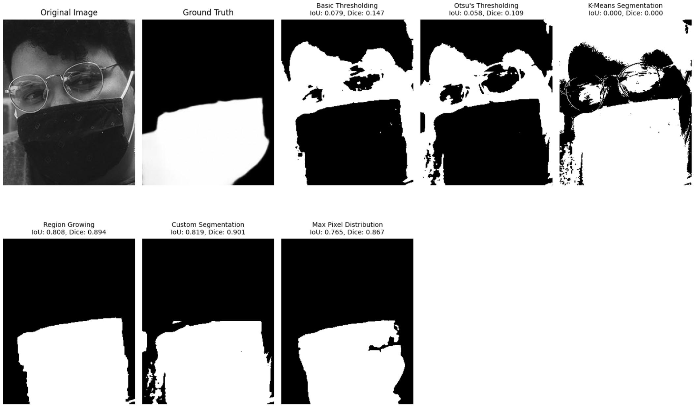
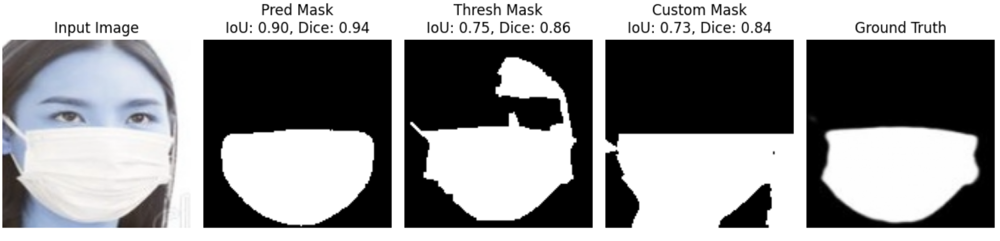

# VR_Mini_Project_1
# Face Mask Classification and Segmentation

## Introduction
The **Face Mask Classification and Segmentation** project aims to detect and segment face masks in images using **machine learning (ML) classifiers**, **deep learning (CNN models)**, and **image segmentation techniques with U-Net model**.  

### Objective  
Develop a computer vision solution to classify and segment face masks in images. The project involves using handcrafted features with machine learning classifiers and deep learning techniques to perform classification and segmentation.

## Repo Structure  

| File/Folder                         | Description  |
|--------------------------------------|-------------|
| **Binary_Classification.ipynb**      | Contains code for binary classification of face mask detection using **ML classifiers** and **CNN models**. |
| **RegionAndMaskSegmentation.ipynb** | Contains code for traditional segmentation approaches and U-Net model for face mask segmentation. |
| **VR Mini Project 1.pdf**            | Provides a detailed problem description and the source of the dataset. |
| **images/**                          | Stores images used in the README.md for reference. |
| **dataset/**                         | Contains the dataset required for binary classification of face masks. |

## Dataset  

## Dataset Source

### Binary Classification  
A labeled dataset containing images of people **with and without face masks** can be accessed here:  
➡ [Face Mask Detection Dataset](https://github.com/chandrikadeb7/Face-Mask-Detection/tree/master/dataset)  

### Region and Mask Segmentation  
A labeled dataset containing **cropped face images** along with their **ground truth masks** can be accessed in the download section here:  
➡ [MSFD (Masked Face Segmentation Dataset)](https://github.com/sadjadrz/MFSD)

## Dataset Structure

### Binary Classification  
The dataset consists of two categories:  
- **Masked Faces**  
- **Unmasked Faces**  

### Region and Mask Segmentation  
The dataset is organized into the following structure:  
- **`1/`** → Main folder containing all dataset files  
  - **`img/`** → Contains original images from which faces were cropped  
  - **`dataset.csv`** → Provides bounding box sizes of detected faces  
  - **`face_crop/`** → Stores all cropped face images  
  - **`face_crop_segmentation/`** → Contains segmented images of cropped faces  
    - Segmented images have the **same filename** as their corresponding cropped face images
    - ⚠ **Note:** One file in this folder has a mismatched filename, which caused an issue during training but was later fixed in the code.  

## How to Run the Code  

This project consists of a **Python notebook**, which can be easily executed by downloading and running it.  
### For Binary Classification Part:  
- The dataset must be uploaded to **Google Drive**.  
- Mount Google Drive in the notebook using:
  ```python
    from google.colab import drive
    drive.mount('/content/drive')
  ```

- Update dataset paths accordingly within the notebook.
### For Segmentation:  
- The dataset must be uploaded to **Kaggle**.  
- A **Kaggle API key** is required to access the dataset within the notebook.  
- Ensure the API key is properly set up before running the segmentation code.
- Update dataset paths accordingly within the notebook.

## Steps taken to achieve each task

### Feature Extraction
To extract meaningful features from the dataset, we used Histogram of Oriented Gradients (HOG). 

- **Grayscale Conversion:** Images were first converted to grayscale to reduce complexity and focus on structural features rather than color.
- **Resizing:** Images were resized to **64x64 pixels** to standardize the input dimensions for the model.
- **HOG Features:** The HOG method was applied to each image to capture gradient information, which is useful for edge detection and texture patterns. The parameters used were:
  - **Pixels per cell:** (8, 8)
  - **Cells per block:** (2, 2)
  - **Feature vector:** True (flatten the HOG features into a single vector).

This resulted in a vector of features that was then fed into machine learning classifiers.

### Model Training for Binary Classification

| Model                         | Hyperparameter Tuning | Notes |
|--------------------------------|-----------------------|-------|
| **SVM (Support Vector Machine)** | GridSearchCV | Used with hyperparameter tuning |
| **Random Forest Classifier**   | GridSearchCV | Optimized using GridSearchCV |
| **Multi-Layer Perceptron (MLP) Neural Network** | Hidden layer sizes, iterations | Tuned for optimal performance |
| **CNN**                        | Learning rate (0.001), epochs (10) | Two convolutional layers, ReLU activations, max pooling, fully connected layers. Used **CrossEntropyLoss** and **Adam optimizer** |

### Segmentation Techniques

| Method | Description |
|--------|-------------|
| **Normal Thresholding** | Applied basic thresholding techniques |
| **Otsu’s Thresholding** | Used Otsu’s method for optimal thresholding |
| **K-Means Clustering** | Seed points chosen randomly or from lower-middle part of image |
| **Region Growing** | Seed points chosen randomly or from lower-middle part of image |
| **Custom Approach** | Masked upper part of the image, applied inverse and binary thresholding |

### U-Net Model

| Parameter | Description |
|-----------|-------------|
| **Dataset Size** | Initial tuning on **4,000 images**, full training in **three batches** |
| **Memory Constraints** | Managed by splitting dataset into batches |
| **Issue Encountered** | Mismatched file caused input-output misalignment, later corrected |


## Hyperparameter Tuning

### SVM (Support Vector Machine)
The SVM classifier was fine-tuned using **GridSearchCV**:
- **C values:** `[0.1, 1, 10]` (Regularization strength)
- **Kernel types:** `['linear', 'rbf']`

### Random Forest
GridSearchCV was used to tune the Random Forest classifier:
- **Number of estimators:** `[50, 100, 200]`
- **Max depth:** `[10, 20, None]` (Control tree depth)
- **Min samples split:** `[2, 5, 10]`

### MLP (Multi-Layer Perceptron)
Optimized by testing different combinations of hidden layer sizes:
- **Hidden Layer Sizes:** `[(64, 32), (128, 64)]`
- **Max iterations:** `[300, 500]`

### CNN (Convolutional Neural Network)
- **Learning Rate:** `0.001`, `0.0005`, `0.0001` → Best: `0.001`
- **Number of Filters:** `32`, `64`, `128` → Best: `32 → 64`
- **Kernel Size:** `3×3`, `5×5` → Best: `3×3`
- **Fully Connected Layer Size:** `128`, `256`, `512` → Best: `128`

### U-Net Model
- **Learning Rate:** `0.001`, `0.0005`, `0.0001` → Best: `0.001`
- **Batch Size:** `8`, `16`, `32` → Best: `8`
- **Epochs:** `30`, `50`, `100` → Used: `30` (Computational constraints)
- **Loss Function:** `Binary cross-entropy`, `Dice score` → Best: `Binary cross-entropy`
- **Dropout Rate:** With/without dropout → Best: `0.1`
- **Image Size:** `128×128`, `256×256` → Used: `128×128` (Computational constraints)
- **Data Augmentation:** Applied  


## Results

### Binary Classification  
The models were evaluated on the test set, and their classification accuracies are as follows:

| Model          | Accuracy  |
|---------------|----------|
| SVM          | **91.45%** |
| Random Forest | **88.89%** |
| CNN          | **95.73%** |
| MLP          | **80.95%** |

### Segmentation  
#### Traditional Segmentation for a random image visualization:
<div style="text-align: center;">
        
        <p>Different traditional segmentation evaluation</p>
 </div>

#### U-Net Model Performance on Test Data  
| Metric        | Value    |
|--------------|---------|
| Accuracy     | **61.40%** |
| Dice Coefficient | **0.8635** |
| IoU Metric   | **0.7599** |

#### Comparison with Traditional Segmentation for a random image  

 <div style="text-align: center;">
        <p>Comparision with Traditional Segmentation for random image</p>
              
 </div>

For a random imag evaluation metric :  
| Method | IoU Metric | Dice Coefficient |
|--------|-----------|------------------|
| **U-Net Model** | **0.90** | **0.94** |
| **Thresholding Mask (Region Growing)** | **0.75** | **0.86** |
| **Custom Mask** | **0.73** | **0.84** |

## Observations and Final Analysis  

### Binary Classification  
- CNN outperformed traditional machine learning models, achieving the highest accuracy.  
- However, CNN required significantly more computational resources for training.  
- The model had multiple hyperparameters that needed fine-tuning compared to simpler algorithms.  

### Segmentation  
- U-Net outperformed traditional segmentation methods but was computationally intensive to train.  
- Among traditional methods, **Region Growing** (with the seed point at the lower middle part of the image) and a **custom segmentation approach** (using inverse and binary thresholding) performed better than other methods.  
## Issues Faced  

### Training CNN
- Hyperparameter tuning was very challenging in training CNN.  
- It took a lot of time to run the code limiting the exploration of possible improvements in hyperparameters.
- Ensuring that the model does not overfits, as it is very easy to overfit a CNN.

### Segmentation Part  


#### File Name Mismatch in MSFD Dataset  
- A naming mismatch in one file within the **face_crop_segmentation** folder caused an **index misalignment** between input and output images from **index 768 onward**.  
- This issue was only **discovered later** during result visualization with **Dice Coefficient** and **IoU Metric**.  
- Due to the late discovery and time constraints, **there was no opportunity to retrain the model for improved accuracy**, though the issue was fixed.  
 

#### Training U-Net Under GPU Constraints  
- **U-Net**, being a complex **CNN-based model**, requires **GPU acceleration** for training. However, **Google Colab** imposes a **daily GPU usage limit**, leading to frequent crashes when attempting to train on the full dataset.  
- After consulting a **TA**, we adopted a **two-step training approach**:  
  1. **Hyperparameter tuning** using only the first **4,000 images**.  
  2. Training the full model with the optimized hyperparameters in **batches** to fit within resource limits.  
- Additionally, due to computational constraints, we had to **reduce the number of epochs** and **resize images** to balance training efficiency and model performance.  


## Member-wise Contribution  

| Member         | GitHub Handle | Contribution |
|---------------|--------------|--------------|
| **Harsh Dhruv** | [@hrdhruv](https://github.com/hrdhruv) | - Implemented Binary Classification Using Handcrafted Features and ML Classifiers. <br> - Assisted in training the U-Net model for mask segmentation (collaborated with Aditya). |
| **Rudra Pathak** | [@rudra0000](https://github.com/rudra0000) | - Implemented Binary Classification using CNN with comparison to ML classifiers. <br> - Assisted in Region Segmentation using Traditional Techniques with a custom thresholding approach (collaborated with Aditya). |
| **Aditya Saraf** | [@NikaYz](https://github.com/NikaYz) | - Implemented Region Segmentation using Traditional Techniques (with assistance from Rudra). <br> - Implemented Mask Segmentation using U-Net (with assistance from Harsh). |

## Future Improvements  

- **Optimize U-Net Model**: The U-Net model was trained with computational constraints, limiting its performance. Training on higher-resolution images with better hardware could enhance segmentation accuracy. 


